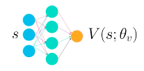
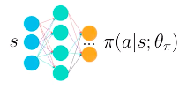

[image1]: ./readme_imgs/1_agent_plot.png "1Agent_Plot"
[image2]: ./readme_imgs/20_agents_plot.png "20Agents_Plot"
[image3]: ./readme_imgs/surrogate_function.png
[image4]: ./readme_imgs/importance_sampling.png
[image5]: ./readme_imgs/REINFORCE.png
[image6]: ./readme_imgs/re-weighting_factor.png
[image7]: ./readme_imgs/PPO_summary.png

# Algorithms

**Report Catalog**

1. [Basic Concepts](#1)
	- 1.1 [On-Policy & Off-Policy](#1.1)
	- 1.2 [Stochastic Policy & Deterministic Policy](#1.2)
	- 1.3 [Value-Based and Policy-Based](#1.3)
2. [Policy Gradient Methods](#2)
	- 2.1 [Hill Climbing](#2.1)
	- 2.2 [REINFORCE](#2.2)
3. [PPO](#3)
	- 3.1 [The Surrogate Function](#3.1)
	- 3.2 [Clipping Policy Updates](#3.2)
	- 3.3 [PPO Summary](#3.3)
4. [Actor-Critic](#4)
	- 4.1 [Basic Actor-Critic Agent](#4.1)
	- 4.2 [A3C](#4.2)
		- 4.2.1 [<del>TD Estimate</del> --> **N-step Boostrapping**](#4.2.1)
			- Monte Carlo estimate
			- TD Estimate
			- N-step Bootstrapping
			- GAE
		- 4.2.2 [<del>ReplayBuffer</del> --> **Parallel Training**](#4.2.2)
		- 4.2.3 [A3C vs. **A2C**](#4.2.3)
	- 4.3 [DDPG](#4.3)
		- 4.3.1 [Continuous Actions](#4.3.1)
		- 4.3.2 [Soft updates](#4.3.2)

<a name="1"></a>
# 1. Basic Concepts 
Define the __policy neural network__.
In Policy-Based Methods, the agent use a neural network to aproximate either a stochastic or a deterministic policy.
Here're some basic concepts of Policy:

<a name="1.1"></a>
## 1.1 On-Policy & Off-Policy

- __On-Policy: π(collecting experience) = π(trained)__
    
    The policy π(collecting experience) used for interacting with the environment is ALSO the policy π(trained).


- __Off-Policy: π(collecting experience) ≠ π(trained)__

    The policy π(collecting experience) used for interacting with the environment is NOT the policy π(trained). 
        - π(collecting experience) is ε-Greedy policy 
        - while π(trained)is the optimal policy.

<a name="1.2"></a>    
## 1.2 Stochastic Policy & Deterministic Policy

- __Stochastic Policy__ wants to learn the Probability Distribution over the actions.
- __Deterministic Policy__ beleives that the best action every single time when we inquire the Actor (Policy) nerual network. Thus it always outputs the best believed action for any given state.

<a name="1.3"></a>
## 1.3 Value-Based and Policy-Based

- __Value-Based Methods__: the agent uses its experience with the environment to maintain an estimate of the optimal action-value function. The optimal policy is then obtained from the optimal action-value function estimate.
```
class Value_Based_Network():
    def __init__():
        ...    
    def forward():
        ...
```
- __Policy-Based Methods__: directly learn the optimal policy, without having to maintain a separate value function estimate.
```
class Policy_Based_Network():
    def __init__():
        ...   
    def forward():
        ...    
    def act():
        ...
```

<a name="2"></a>
# 2. Policy Gradient Methods

<a name="2.1"></a>
## 2.1 Hill Climbing 
Pseudocode


NOTE: __Episode Return G__ vs. __Expected Return J__

Due to randomness in the environment(and the policy, if it is stochastic), it is highly like that if we collect a second episode with the same values for θ, we'll likely get a different value for the return G.
The (sampled) return **G** is not a perfect but good enough __estimate for the expected return J__.

<a name="2.2"></a>
## 2.2 REINFORCE
![][image5]

<a name="3"></a>
# 3. PPO (Proximal Policy Optimization Algorithms)

**References**

- Paper [PPO](https://arxiv.org/pdf/1707.06347.pdf)

---
<a name="3.1"></a>
## 3.1 The Surrogate Function

The __importance sampling__ below tells us we can use old trajectories for computing averages for new policy, as long as we add this extra re-weighting factor, that takes into account how under or over–represented each trajectory is under the new policy compared to the old one.


---

Expanding the __re-weighting factor__:


---

The approximate form of the gradient, we can think of it as the gradient of a new object, called the __surrogate function__

So using this new gradient, we can perform gradient ascent to update our policy -- which can be thought as directly maximize the surrogate function.

<a name="3.2"></a>
## 3.2 Clipping Policy Updates
One problem of surrogate function is that it could lead to a really bad policy that is very hard to recover from. Let's see how:


To solve this problem, we apply a clipping function as below:

The updates remain the same, until we hit the flat plateau. Now because the reward function is flat, the gradient is zero, and the policy update will stop.

---

Implement the PPO algorithm as well, and the scalar function is given by:


the clipped function is implemented in pytorch as ```torch.clamp(ratio, 1-epsilon, 1+epsilon)```

<a name="3.3"></a>
## 3.3 PPO Summary

PPO(Proximal Policy Optimization) algorithm:


<a name="4"></a>
# 4. Actor-Critic

<a name="4.1"></a>
## 4.1 Basic Actor-Critic Agent
 
An Actor-Critic agent uses _function approximation_ to learn _policy_ and _value function_, using __two networks__:

- __Critic__: learns  to evaluate the state-value function using _TD estimate_.
- __Actor__: uses the critic to calculate _advantage function_ and then train the actor using this value.

__Training Process__:

---

**1. Collect Experience** 


- input current state __s__ to the __Actor__(local network) 
- output the probability distribution of actions
- act action __a__ in environment
- receive reward __r__ and next state __s'__

---

**2. Update Critic**


- input __(s,a,r,s')__ to __Critic__ 
- use __TD estimate__ to train __Critic__

---

**3. Update Actor**


- use the updated __Critic__(local network) to calculate the __Advantage A(s,a)__ 
- train the __Actor__ using the calculated __A(s,a)__ as a Baseline

---

<a name="4.2"></a>
## 4.2 A3C (Asynchronous Advantage Actor-critic)

**References**

- Paper: [A3C](https://arxiv.org/pdf/1602.01783.pdf)
- Github: [pytorch-a3c](https://github.com/ikostrikov/pytorch-a3c), [continuous_A3C](https://github.com/MorvanZhou/pytorch-A3C/blob/master/continuous_A3C.py)

---
<a name="4.2.1"></a>
### 4.2.1 <del>TD Estimate</del> --> N-step Boostrapping
[Reference](https://www.jeremyjordan.me/rl-learning-implementations/)

---
**Monte Carlo Estimate**

The Monte Carlo approach approximates the value of a state-action pair by calculating the mean return from a collection of episodes. GLIE Monte-Carlo is an on-policy learning method that learns from complete episodes. 


Here, `Gt` either represents the return from time t when the agent first visited the state-action pair, or the sum of returns from each time t that the agent visited the state-action pair, depending on whether you are using __first-visit__ or __every-visit__ Monte Carlo.

---
**TD Estimate**

The temporal difference approach approximates the value of a state-action pair by comparing estimates at two points in time.

SARSA: 

Q-Learning: 

---
**N-step Bootstrapping**

Instead of using TD estimate, A3C will use N-step Bootstrapping. It's simply a abstraction and generalization of TD Estimate and Monte-Carlo Estimate.


|estimate|step n|variance|bias|update|
|:---:|:---:|:---:|:---:|:---:|
|TD|n = 1|low|high||
|Monte Carlo|n = ∞|high|low||
|N-step Bootstrapping|1 < n < ∞|under control|less||

---
**GAE** (Generalized Advantage Estimation)


---
<a name="4.2.2"></a>
### <del>ReplayBuffer</del> --> Parallel Training

A3C replace ReplayBuffer with Parallel Training.

A3C creates multiple instances of the environments and agents, and then runs them all at the same time. Thus the agents will likely be experiencing different states at any given time.
This way of training allows us to _on-policy_ learning in our learning algorithm.

---
<a name="4.2.3"></a>
### A3C vs. A2C

- A3C: each agent update a local copy of Neural Network on its own.
 
__A3C__(Asynchronous Advantage Actor-critic) accumulated gradient updates and apply those __updates asychronously__ to a global neural network. Each agent dose the gradient updates at __its own time__. To be more specific, each agent use a local copy of NN to collect experience --> calculate & accumulate gradient update.

- __A2C__ synchronize all agents


1. finish a segment of interaction with its copy of the environment
2. update the neural network at once
3. send the update weights back to all Agents

---

<a name="4.3"></a>
## 4.3 DDPG (Deep Deterministic Policy Gradients)

**References**

- Papers: [DDPG](https://arxiv.org/abs/1509.02971), [D4PG](https://openreview.net/pdf?id=SyZipzbCb)(Distributed Distributional DDPG)
- Github: [ddpg-bipedal](https://github.com/udacity/deep-reinforcement-learning/tree/master/ddpg-bipedal), [ddpg-pendulum](https://github.com/udacity/deep-reinforcement-learning/tree/master/ddpg-pendulum), [DeepRL](https://github.com/ShangtongZhang/DeepRL)

Key words for DDPG:

- Continuous Actions
- ReplayBuffer
- Soft Updates

---
<a name="4.3.1"></a>
### 4.3.1 Continuous Actions

DDPG could be seen as approximate DQN instead of an actual actor critic. This is because the critic in DDPG is used to approximate the maximizer over Q(t+1) (Q values of the next state) and not as a learned baseline.

|Actor-Critic|Actor|Critic|
|:----------:|:---:|:----:|
|Base|||
|Base|__stochastic__, learn a probability distribution over the actions||
|DDPG|||
|DDPG|__deterministic__, always outputs the best believed action for any given state to approximate the optimal policy|learns to evaluate the optimal action value function by using the actor, which is an approximate maximizer, to calculate a new target value for training the action value function.|

---
<a name="4.3.2"></a>
### 4.3.2 Soft updates

In DQN the target network is fixed for 10000 time steps and then it gets a big update. However in DDPG we use soft updates. A __soft update__ strategy consists of slowly blending your regular/local network weights with your target network weights. Every step, mix in 0.01% of regular/local network weights into target network weights. 

The regular/local network is the most up-to-date because it's the one we're training, while the target network is the one used for prediction to stabilize strain. Soft update gets faster convergence and can be use to other algorithms that use target networks including DQN.