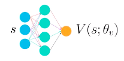
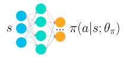
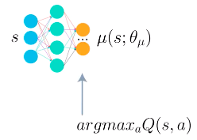
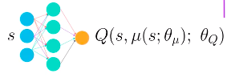
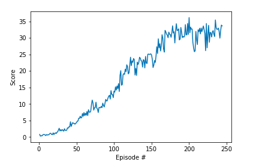

# Report

**Catalog**

1. [Learning Algorithm](#1)
	- [1.1 My Policy: DDPG](#1.1)
		- [1.1.1 Continuous Actions](#1.1.1)
		- [1.1.2 Soft updates](#1.1.2)
	- [1.2 Code Amendments](#1.2)
		- [1.2.1 Single Agent to Multiple Agent](#1.2.1)
		- [1.2.2 Gradient Clipping](#1.2.2)
		- [1.2.3 Less Aggressive Update Frequency](#1.2.3)
		- [1.2.4 Noise of Actor Selection](#1.2.4)
2. [Plot of Rewards](#2)
3. [Problems & Puzzles](#3)
4. [Ideas for Future Work](#4)

## 1. Learning Algorithm

Mmore details and summary about policy-based methods see [Algorithms.md](Algorithms.md).

---
<a name="1.1"></a>
### 1.1 My Policy: DDPG

I solved the project by making some amendments to the Deep Deterministic Policy Gradients (DDPG) algorithm.

**References**

- Papers: [DDPG](https://arxiv.org/abs/1509.02971), [D4PG](https://openreview.net/pdf?id=SyZipzbCb)(Distributed Distributional DDPG)
- Github: [ddpg-bipedal](https://github.com/udacity/deep-reinforcement-learning/tree/master/ddpg-bipedal), [ddpg-pendulum](https://github.com/udacity/deep-reinforcement-learning/tree/master/ddpg-pendulum), [DeepRL](https://github.com/ShangtongZhang/DeepRL)

Key words for DDPG:

- Continuous Actions
- ReplayBuffer
- Soft Updates

---
<a name="1.1.1"></a>
### 1.1.1 Continuous Actions

DDPG could be seen as approximate DQN instead of an actual actor critic. This is because the critic in DDPG is used to approximate the maximizer over Q(t+1) (Q values of the next state) and not as a learned baseline.

|Actor-Critic|Actor|Critic|
|:----------:|:---:|:----:|
|Base|||
|Base|__stochastic__, learn a probability distribution over the actions||
|DDPG|||
|DDPG|__deterministic__, always outputs the best believed action for any given state to approximate the optimal policy|learns to evaluate the optimal action value function by using the actor, which is an approximate maximizer, to calculate a new target value for training the action value function.|

---
<a name="1.1.2"></a>
### 1.1.2 Soft updates

In DQN the target network is fixed for 10000 time steps and then it gets a big update. However in DDPG we use soft updates. A __soft update__ strategy consists of slowly blending your regular/local network weights with your target network weights. Every step, mix in 0.01% of regular/local network weights into target network weights. 

The regular/local network is the most up-to-date because it's the one we're training, while the target network is the one used for prediction to stabilize strain. Soft update gets faster convergence and can be use to other algorithms that use target networks including DQN.

---
<a name="1.2"></a>
## 1.2 Code Amendments
I adapt the code from the project 
[ddpg-pendulum](https://github.com/udacity/deep-reinforcement-learning/tree/master/ddpg-pendulum), while making few modifications to adapt it to the `Reacher` environment in this project.

---
<a name="1.2.1"></a>
### 1.2.1 Single Agent to Multiple Agent
A single agent with each step:

- the agent adds its experience to the replay buffer, and
- the (local) actor and critic networks are updated, using a sample from the replay buffer.

20 agents with each step:

- each agent adds its experience to a replay buffer that is shared by all agents, and
- the (local) actor and critic networks are updated 20 times in a row (one for each agent), using 20 different samples from the replay buffer.

---
<a name="1.2.2"></a>
### 1.2.2 Gradient Clipping
```
self.critic_optimizer.zero_grad()
critic_loss.backward()
torch.nn.utils.clip_grad_norm(self.critic_local.parameters(), 1)
self.critic_optimizer.step()
```

---
<a name="1.2.3"></a>
### 1.2.3 Less Aggressive Update Frequency
In particular, instead of updating the actor and critic networks 20 times at every timestep, we amended the code to update the networks 10 times after every 20 timesteps to get less aggressive with the number of updates per time step. So I modify `step()` function in `ddpg_agent.py` from:

```
def step(self, state, action, reward, next_state, done):
    self.memory.add(state, action, reward, next_state, done)

    if len(self.memory) > BATCH_SIZE:
        experiences = self.memory.sample()
        self.learn(experiences, GAMMA)
```
to:

```
def step(self, states, actions, rewards, next_states, dones, 
             update_every=1, update_times=None):
    for state, action, reward, next_state, done in zip(states, actions, rewards, next_states, dones):
        self.memory.add(state, action, reward, next_state, done)
    
    if update_times == None:
        update_times = self.num_agents
    self.timestep_count +=1

    if (len(self.memory) > BATCH_SIZE) and (self.timestep_count == update_every):
        self.timestep_count = 0
        for i in range(update_times):
            experiences = self.memory.sample()
            self.learn(experiences, GAMMA)

```

---
<a name="1.2.4"></a>
### 1.2.4 Noise of Actor Selection

I replaced the noise distribution type in `sample()` fuction of `OUNoise` class in `ddpg_agent.py` from uniform distribution:

```
dx = self.theta * (self.mu - x) + self.sigma * np.array([random.random() for i in range(len(x))])
```

to normal/Gaussian distribution:

```
dx = self.theta * (self.mu - x) + self.sigma * np.random.standard_normal(self.size)
```

---
<a name="2"></a>
## 2. Plot of Rewards



<a name="3"></a>
## 3. Problems & Puzzles

Q1: Why apply gradient clipping to Critic?

PPO algorithm applies clipping function to policy updates. Why apply gradient clipping to critic updates while using DDPG? And why apply it to critic rather than actor?

--- 
Q2: What does `WEIGHT_DECAY` do? (line 18 and 49 in [ddpg_agent.py](ddpg_agent.py))

---
Q3: As to A3C, how to calculate the final weights/parameters of policy?

Since in A3C algorithm, multiple agents respectively interact with a copy of environment, collect experience at their own time and training their own copy of policy network, there will be mutilple policy with the same neural network
structure but different weights/parameters. How to calculate the final weights/parameters as training outcome?

<a name="4"></a>
## 4. Ideas for Future Work

Apply N-step Bootstrapping instead of TD estimate in critic updates.
